Command line tools for the expert searcher: Some applied library carpentry
==========================================================================

Author: Helge Knüttel

This repository started to give more information and code as a background for a poster presented at the [2020 conference](https://eahil2020.wordpress.com/) of [EAHIL](http://eahil.eu/) intended to happen in Lodz, Poland but was then held as an online event due to the COVID-19 pandemic. It is intendend that the use-cases and code sections will be extended in the future.

All stuff related to the actual poster incl. the [poster pfd](./poster/Poster_EAHIL_2020.pdf) and the [abstract](./poster/abstract_submitted.md) are found in the `poster` folder.


[[_TOC_]]


## General

What do I mean by the term "command line" here? Two things, actually: One of the [shell programs](https://en.wikipedia.org/wiki/Shell_(computing)) commonly used with Unix-like operating systems that provide the [command line interface](https://en.wikipedia.org/wiki/Command-line_interface) used to interact with the computer (e.g. [bash](https://en.wikipedia.org/wiki/Bash_(Unix_shell))) and a basic set of programs expected to exist on every such system. In particular, these are the the [GNU core utilities (Coreutils)](https://www.gnu.org/software/coreutils/) and the non-interactive text editor [sed](https://www.gnu.org/software/sed/).

### Tutorials for learning the command line

* [FLOSS Manuals: Command line](http://write.flossmanuals.net/command-line/introduction/): An introduction into using the command line.
* [Openning the software toolbox](https://www.gnu.org/software/coreutils/manual/coreutils.html#Opening-the-software-toolbox): The spirit of combining many small tools to acheive what you need.
* [Sh - the POSIX Shell ](https://www.grymoire.com/Unix/Sh.html): Specifics on the POSIC shell. Might help to create more portable scripts.


## Use cases

<!-- GitHub wil not render the Mermaid code (now in poster/use_cases.mermaid); show image instead. -->



Some example files with bibliographic data are in the `test/data` folder.


### Checking search results

Search results are ususally exported from databases and then imported in to reference management software or other systematic review software. It is helpful to be able to do some basic data sanity checks on the structured text files that were exported due to a number of reasons. The export process may yield erroneous results especially when restrictions by the host interface force the expert searcher to download larger result sets in smaller chunks (a tedious and error-prone process). There may be duplicate records even when exporting from a single database (which stands in contrast to vendor's documentation). And some records may be corrupt or formatted in a way such that the import filter of reference management software fails.


#### Ovid MEDLINE and Ovid Embase

##### Count the records in a single export file

Export result are in a single file in Citavi (\*.ovd), Endnote (\*.cgi) or ReferenceManager (\*.ovd) format (Fields: _Complete Reference_). This works for ovd- and cgi-files:

```bash
grep --count "^DB  - Embase" myproject_EMBASE_2018-12-13_records-combined.ovd
```

**Result**:

```
3831
```


##### Count the records in a batch of export files

After exporting results in portions of the allowed maximum of 1,000 records count the records in each of the exported files:

```bash
for file in `find . -name 'myproject_EMBASE_2018-12-13_r*-*.cgi' -print` ; do echo $file;  grep "^DB  - Embase" $file | wc -l ; done
```

```
./myproject_EMBASE_2018-12-13_r0001-1000.ovd
1000
./myproject_EMBASE_2018-12-13_r1001-2000.ovd
1000
./myproject_EMBASE_2018-12-13_r2001-3000.ovd
1000
./myproject_EMBASE_2018-12-13_r3001-3831.ovd
831
```

**Result**: The individual files contain the expected numbers of records with a total of 3831 records.


##### Check for duplicate records in export files

Usually, in larger result sets there are duplicate records, i.e. records that carry identical accession numbers. This is in contrast to the database documentation.  

First, we check for duplicates _in each export file_. Accession numbers are in the UI field:

```bash
for file in `find . -name 'myproject_EMBASE_2018-12-13_r*-*.ovd' -print` ; do echo $file;  grep "^UI  - " $file | sort | uniq | wc -l ; done
```

```
./myproject_EMBASE_2018-12-13_r0001-1000.ovd
983
./myproject_EMBASE_2018-12-13_r1001-2000.ovd
1000
./myproject_EMBASE_2018-12-13_r2001-3000.ovd
1000
./myproject_EMBASE_2018-12-13_r3001-3831.ovd
831
```

**Result**: 17 duplicate records were omitted when counting unique accession numbers in the first export file.  

Finally, we count the unique records _accross all export files_. This number of unique records should not be off to far from the total number of records, say at most a few dozen. If the unique records are below the total by 1,000 or more chances a high that we erroneously exported a chunk of records twice (and ommitted another chunck).

```bash
grep --no-filename "^UI  - " myproject_EMBASE_2018-12-13_r*-*.ovd | sort | uniq | wc -l
```

```
3813
```

**Result**: In the 3831 records of the search result there are 3813 unique records. We did not fail to export a chunk.


#### Web of Science (Core Collection)

Export format _Other reference software_, record content _Full record_.


##### Count the records in a single export file

```
grep --count "^ER$" test/data/WoS_other_reference_software_records_combined.txt
```

**Result**:

```
4012
```

##### Count the records in a batch of export files

After exporting a larger result set in portions of the allowed maximum of 500 records count the records in each export file:

```bash
for file in `find . -name 'WoS_other_reference_software_r*-*.txt' -print` ; do echo $file;  grep --count "^ER$" $file ; done
```

```
./test/data/WoS_other_reference_software_r0001-0500.txt
500
./test/data/WoS_other_reference_software_r0501-1000.txt
500
./test/data/WoS_other_reference_software_r1001-1500.txt
500
./test/data/WoS_other_reference_software_r1501-2000.txt
500
./test/data/WoS_other_reference_software_r2001-2500.txt
500
./test/data/WoS_other_reference_software_r2501-3000.txt
500
./test/data/WoS_other_reference_software_r3001-3500.txt
500
./test/data/WoS_other_reference_software_r3501-4000.txt
500
./test/data/WoS_other_reference_software_r4001-4012.txt
12
```

**Result**: The individual files contain the expected numbers of records with a total of 4012 records.

Then, we count the unique accession numbers of the records _accross all export files_. This number of unique records should be identical to the total number of records. If not chances a high that we erroneously exported a chunk of records twice (and ommitted another chunck).

```bash
grep --no-filename "^UT " test/data/WoS_other_reference_software_r*-*.txt | sort | uniq | wc -l
```

**Result**:

```
4012
```

**Result**: In the 4012 records of the search result there are 4012 unique records. We did not fail to export a chunk.


#### PubMed

Count the records in a single export file in PubMed format (was called MEDLINE format in legacy PubMed):

```bash
grep --count "^PMID- " medline.txt
```

Count the records in an export file in XML format:

```bash
grep -c "^<PubmedArticle>$" medline.xml
```


### Postprocessing search result for easier import

Unite search results that had to be exported in chunks into a single file. This saves time and is less prone to errors from repetitive import tasks.

#### Ovid MEDLINE and Ovid Embase

For the Ovid files we just need to concatenate the individual export files into a single one:


```bash
cat myproject_EMBASE_2018-12-13_r*-*.ovd > myproject_EMBASE_2018-12-13_records-combined.ovd
```

Check the generated file for coḿpleteness:

```bash
grep --count "^DB  - Embase" myproject_EMBASE_2018-12-13_records-combined.ovd
```

```
3831
```

**Result**: A total of 3831 records is in the generated file.

Count the unique records in the file:

```bash
grep "^UI  - " myproject_EMBASE_2018-12-13_records-combined.ovd | sort | uniq | wc -l
```

```
3813
```

**Result**: The expected number of unique records is in the file. We are safe to import this file into the reference manager.


#### Web of Science

Web of Science allows to download no more than 500 records at a time. Therefore, it is particularly helpful to combine the export files.  

Export format:

* Other file format --> Record content: Full Record; File Format: Other reference software (.txt-file)
* Endnote Desktop --> Record content: Full Record (.ciw-file)

These formats are identical with the exception of a byte-mark at the beginning of the .txt-files.  

Web of Science export files contain a header and footer. As we need to take care of this we cannot just concatenate files as with other formats. But a [small skript](./bin/unite_wos_files) takes care of this:


```bash
unite_wos_files test/data/WoS_other_reference_software_r*.txt > test/data/WoS_other_reference_software_records_combined.txt
```

Then check the number of records in the new file as above.


### Building query strings

#### Known record searches by accession numbers or DOIs

Build queries from lists of accession numbers or DOIs. This comes in handy for

* removing records on the host that were found in earlier searches when updating searches, 
* removing records on the host that were already found in other databases (partial on-the-host deduplication), and
* known item searches for test sets with know relevant records in order to check search strategies.

For more details see below in the sections _Updating searches_ and _Build reusable scripts_.


#### Reverse the order of lines in search strategy

Search interfaces often show the lines in a search strategy such that the last search statement is on top. This order may persist in an exported search strategy (e.g. by copying from a browser window). But this order is inconvenient when the search strategy should be entered again into a search interface, possibly after some modifications. It is easy to reverse the order of lines with the `tac` tool (Mnemonic: This is the reverse of `cat`).

```bash
tac my_old_stategy.txt > stategy_with_lines_reversed.txt
```

When editing a file in the `vim` editor there basically are two options:

* Call `tac`, e.g. `:%!tac` for the wole buffer.
* Use vim's features: `:g/^/m0`

For more info see <https://vim.fandom.com/wiki/Reverse_order_of_lines>.


### Updating searches

The approach in general is to work with accession numbers of database records:

1. Extract the PMIDs from the export files of first search, 
2. construct a query string for these PMIDs (or several to do it in batches of say a 1,000),
3. run the update search,
4. search the records of the old search (using the query strings created as above),
5. NOT the old records out of the new search result.

Steps 1 and 2 are a matter of seconds when using command line tools.

Examples are given here for PubMed and Ovid MEDLINE. There are two scripts, [`extract_accession_numbers`](./bin/extract_accession_numbers) and [`an2query`](./bin/an2query) that make this easier.

#### PubMed

Extract the PMIDs from the export files of first search:

```bash
grep "^PMID- " pubmed-export-set.txt | sed -e 's/^PMID- //' > pubmed-export-set_pmid.txt
```

Construct a query string for these PMIDs (or several to do it in batches of say a 1,000). Steps: 

 * Pipe content of file with PMIDs to `sed` for processing.
 * Add '"' to beginning of each line of the input.
 * Add '"' and field specification to end of each line of the input.
   Whitespace at beginning or end of line will be deleted.
 * Add ' OR ' to end of each line except the last one.
 * Write result to a text file.

```bash
cat pubmed-export-set_pmid.txt | \
sed\
    -e 's/^\s*/"/' \
    -e "s/\s*$/\"\[UID\]/" \
    -e '$! s/$/ OR /' \
> pubmed-export-set_query.txt
```

#### Ovid MEDLINE

Extract the PMIDs from the export files of first search:

```bash
grep "^UI  - " myproject_MEDLINE_2018-04-25.cgi  | \
sed -e 's/^UI  - //' -e 's/\r//g' \
> myproject_MEDLINE_2018-04-25_uid.txt
```

Construct a query string for these PMIDs (or several to do it in batches of say a 1,000). Steps: 

 * Pipe content of file with PMIDs to `sed` for processing.
 * Delete empty lines or lines containig only whitespace.
 * Add '"' to beginning of each line of the input.
 * Add '"' to end of each line of the input.
   Whitespace at beginning or end of line will be deleted.
 * Add ' OR ' to end of each line except the last one.
 * Add "(" to beginning of file
 * Add ")" and field specification to end of file
 * Write result to a text file.

```bash
cat myproject_MEDLINE_2018-04-25_uid.txt | \
sed\
    -e '/^\s*$/d' - | \
sed\
    -e 's/^\s*/"/' \
    -e 's/\s*$/"/' \
    -e '$! s/$/ OR /' | \
sed\
    -e '1 i (' \
    -e '\$ a ).ui.' \
> myproject_MEDLINE_2018-04-25_query.txt
```

### Documenting searches


#### Document database accession numbers

Extract accesion numbers of database records from exported search result. It may be helpful to document these result sets for various purposes, either just for internal use or better yet as a publicly available piece of research data with the published report. Publishing lists of accessions numbers will not infringe the copyright of database vendorsi which might be the case when publishing whole database records containing text.


Extract PMIDs from Ovid MEDLINE export file into a text file:

```bash
grep "^UI  - " myproject_MEDLINE_2018-12-13_records-combined.ovd | sed -e 's/^UI  - //' -e 's/\r//g' > myproject_MEDLINE_2018-12-13_records-combined_pmid.txt
```

Extract Embase accession numbers from Ovid Embase export file into a text file:

```bash
grep "^UI  - " myproject_EMBASE_2018-12-13_records-combined.ovd | sed -e 's/^UI  - //' -e 's/\r//g' > myproject_EMBASE_2018-12-13_records-combined_uid.txt
```
These text files can also be used for deduplicating search results and especially so when running update searches.


#### Convert Ovid search history to table

Use a vim script.


## Build reusable scripts

It is helpful to write down the commands that worked well in a shell script. Such a script is a convenient means to store the functionality for easy reuse. The gory details that are hard to remember are hidden away in the script. Some skripts are contained in the [bin ](./bin/) folder.

Examples:

```bash
# Count the records in an exported search result by accession numbers.
cat ovid_embase_export.cgi | extract_accession_numbers --format ovid_embase | wc -l

# Extract the accession numbers from an exported search result to a file for purposes of documentation and reuse.
cat ovid_embase_export.cgi | extract_accession_numbers --format ovid_embase > ovid_embase_export_uid.txt

# Extract the accession numbers from an exported search result and build a database query to find these records.
cat ovid_embase_export.cgi | extract_accession_numbers --format ovid_embase | an2query --syntax ovid_embase --idtype an > query.txt

```


## Use NLM's Entrez Direct (EDirect)

The [EDirect utilities](https://www.ncbi.nlm.nih.gov/books/NBK179288/) provided by [NLM's](https://www.nlm.nih.gov/) [NCBI](https://www.ncbi.nlm.nih.gov/) are a set of very powerful tools to be used at the Unix command line. They ...

**This is all still work inprogress!**


### Retrieving search results from PubMed

The new PubMed no longer supports downloading records in XML format. But we can do this with [EDirect](https://www.ncbi.nlm.nih.gov/books/NBK179288/):


1. Save your search results as a list of PMIDs as a file, e.g. pmid.txt.
2. On the command line with bash run

```bash
cat pmid.txt | epost -db pubmed | efetch -format xml > medline.xml
```

This yields the records in XML format in the file medline.xml. This also works for large numbers of records. Downloading in PubMed format (called MEDLINE format in legacy PubMed) is possible, too:


```bash
cat pmid.txt | epost -db pubmed | efetch -format medline > medline.txt
```


### Searching for patterns that are not supported by search interfaces


#### Use command line tools like grep to post-process a selected number of records (from a more general search) that was downloaded

Example: Find PubMed records that contain information about equally contributing authors.

This information is not searchable in PubMed but the information is contained in the XML format of PubMed records. See [Equal Contribution for Authors in PubMed](https://www.nlm.nih.gov/pubs/techbull/so17/so17_contrib_equal_author_pubmed.html).

```bash
esearch -db pubmed -query "Regensburg[AD] AND 2018:2020[DP]" | efetch -format xml > regensburg_2018-2020.xml
cat regensburg_2018-2020.xml  | xtract -pattern PubmedArticle -element MedlineCitation/PMID | wc -l
# 4113
root@71a097f1c1ef:/edirect# cat regensburg_2018-2020.xml  | xtract -pattern PubmedArticle -element MedlineCitation/PMID -block Author -element "@EqualContrib" | grep "[Y|N]" | cut -f 1 | wc -l
# 158
cat regensburg_2018-2020.xml  | xtract -pattern PubmedArticle -element MedlineCitation/PMID -block Author -element "@EqualContrib" | grep Y | cut -f 1 | wc -l
# 42
root@71a097f1c1ef:/edirect# cat regensburg_2018-2020.xml  | xtract -pattern PubmedArticle -element MedlineCitation/PMID -block Author -element "@EqualContrib" | grep N | cut -f 1 | wc -l
# 122

```


#### Use local phrase searching using eDirect and a local copy of PubMed


### Installation of Entrez Direct

Entrez Direct (EDirect) needs to be installed. This is easy with a Linux or Macintosh system where the prerequisites already are available (a bash shell and Perl). For my Windows 10 PC I found it easiest to go via [Docker Desktop for Windows](https://hub.docker.com/editions/community/docker-ce-desktop-windows) and then use the [official NCBI/NLM Docker image for edirect](https://hub.docker.com/r/ncbi/edirect). 

Once Docker for Windows is installed and running open a PowerShell to pull the EDirect image (only once) and start it:

```{PowerShell}
docker pull ncbi/edirect
docker run -it --rm ncbi/edirect
```

To share a directory:

```bash
```

```bash
```

### Search and analyze results


#### Where could I publish a protocol for a systematic review?

Journals in which many SR protocols are published may be particularly suitable for submission.

* Find PubMed records of protocols of systematic reviews.
* Extract the journal title.
* Group by journal, count records and sort by rank.

```bash

esearch -db pubmed -query '("systematic review"[TI]) AND ("protocol"[TI])' | efetch -format xml > SR_protocols.xml

cat SR_protocols.xml | xtract -pattern PubmedArticle -element Journal/Title | sort-uniq-count-rank | head -10

```
Results:

```
1253    Medicine
1022    BMJ open
1016    Systematic reviews
504     JBI database of systematic reviews and implementation reports
89      JBI evidence synthesis
81      JMIR research protocols
22      Acta anaesthesiologica Scandinavica
19      JBI library of systematic reviews
18      International journal of surgery protocols
18      Journal of advanced nursing
```


